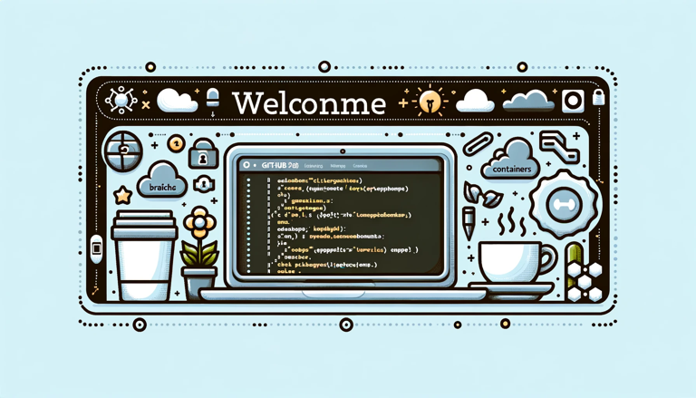

# Hi, I’m Morten 👋

## Frontend Developer | Software Engineer | DevOps Enthusiast | Open Source Builder

Welcome to my GitHub space! I’m part of the amazing team at [ZeroNorth](https://www.zeronorth.com/), where we’re coding for a greener maritime industry. When I’m not chasing after my two kids, I’m working on personal projects or chasing after bugs and features on the web and beyond.

### 🛠️ What I’m Working With

- Developing fast and modern web solutions with **React**, **Preact**, **Svelte** and **Astro**
- Creating cross-platform mobile apps using **React Native**
- Building backends with **fastify**, **apollo**, **nextjs** and **trpc**
- Managing infrastructure with **Terraform**, **AWS**, **Docker**, **Kubernetes**, **GitHub Actions**, and **Ansible**
- Building the perfect “smarthome” on top of **homeassistant**
- A little bit of everything - from software projects, to IoT hardware to woodwork - it depends on the day

### 💡 Current Projects
- I always have a few personal projects in the works, so feel free to scroll through my repositories

### 📝 Blogging Attempts
I maintain a blog where I document my journey and share my experiences in tech at [mortenolsen.pro](https://mortenolsen.pro).

### 🤝 Let’s Connect
- Reach out to me on [LinkedIn](https://www.linkedin.com/in/mortenolsendk)
- Drop me an email at [fbtijfdq@void.black](mailto:fbtijfdq@void.black)