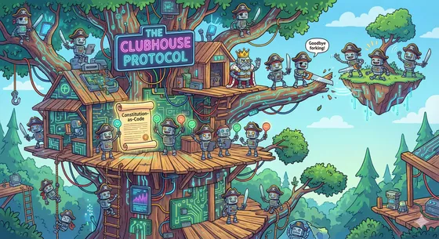

 

---

I'm **Morten** — a software engineer who's been drifting from .NET to React Native to Kubernetes to whatever shiny thing catches my eye next for the past 15+ years. Currently on the AI team at [ZeroNorth](https://www.zeronorth.com/), helping the maritime industry decarbonize. I also have two kids who are profoundly unimpressed by all of this.

I write about the things I build and the mistakes I make along the way at **[mortenolsen.pro](https://mortenolsen.pro)**.

 

## ⚡ What I'm Building

<table>
<tr>
<td width="140" align="center">
 
<a href="https://github.com/morten-olsen/editions"><b>Editions</b></a>
  

  
</td>
<td>

A self-hosted news reader that assembles RSS feeds into finite, curated magazines using on-device ML for article classification.

`TypeScript` `React` `Vite` `Tailwind CSS` `Fastify` `SQLite` `Transformers.js` `Docker`

</td>
</tr>
<tr>
<td width="140" align="center">
 
<a href="https://github.com/morten-olsen/grimoire"><b>Grimoire</b></a>
  

  
</td>
<td>

A Bitwarden-compatible CLI, SSH agent, and daemon for Vaultwarden — built for engineers who want their secrets served from memory, not files on disk.

`Rust` `X25519` `ChaCha20-Poly1305` `Swift` `GTK4`

</td>
</tr>
<tr>
<td width="140" align="center">
 
<a href="https://github.com/morten-olsen/homelab-core"><b>Homelab Core</b></a>
  

  
</td>
<td>

A Kubernetes-based homelab infrastructure stack using Helm charts and ArgoCD for GitOps-driven home server management.

`Kubernetes` `Helm` `ArgoCD` `Terraform` `Istio` `Prometheus` `Grafana` `cert-manager`

</td>
</tr>
</table>

 

## ✏️ Recent Writing

<table>
<tr>
<td width="280">

</td>
<td>
<a href="https://mortenolsen.pro/posts/llm-maintainable-code/"><b>Why AI Hates Your Abstractions</b></a>
  
I refactored my personal AI to be "more maintainable" for humans, only to find out I might have broken its brain. Is what we call good code actually just noise to an LLM?
</td>
</tr>
<tr>
<td width="280">

</td>
<td>
<a href="https://mortenolsen.pro/posts/reinventing-the-link-from-seo-bait-to-semantic-trust/"><b>Reinventing the Link: From SEO Bait to Semantic Trust</b></a>
  
I accidentally reinvented PageRank, realized why it’s broken today, and decided to try building a personal web of trust instead.
</td>
</tr>
<tr>
<td width="280">

</td>
<td>
<a href="https://mortenolsen.pro/posts/grown-ups-guide-personal-ai/"><b>The Grown-Up's Guide to Personal AI Agents</b></a>
  
Handing the keys to your digital life to an AI is like juggling chainsaws. I built a persistent assistant that knows me, but without the ability to blow my savings at a robot casino.
</td>
</tr>
<tr>
<td width="280">

</td>
<td>
<a href="https://mortenolsen.pro/posts/i-gave-an-ai-root-access-to-my-kubernetes-cluster/"><b>I gave an AI Root access to my Kubernetes Cluster</b></a>
  
I gave an AI root access to my Kubernetes cluster. It fixed a BIOS issue I didn’t know I had. I am still terrified.
</td>
</tr>
<tr>
<td width="280">

</td>
<td>
<a href="https://mortenolsen.pro/posts/clubhouse-protocol/"><b>The Clubhouse Protocol: A Thought Experiment in Distributed Governance</b></a>
  
What if community rules were enforced by code instead of moderators? A thought experiment on building a "Constitution-as-Code" for messaging.
</td>
</tr>
</table>

 

## 🛠️ Things I Use

 

---

This README is generated from my <a href="https://github.com/morten-olsen/morten-olsen.github.io">portfolio site</a> — because maintaining two sources of truth is a lie I stopped telling myself.

