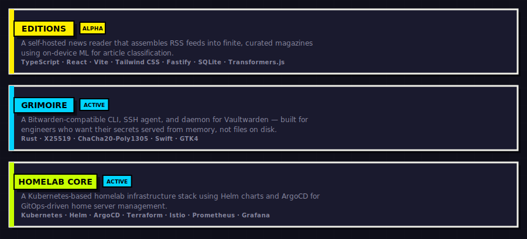
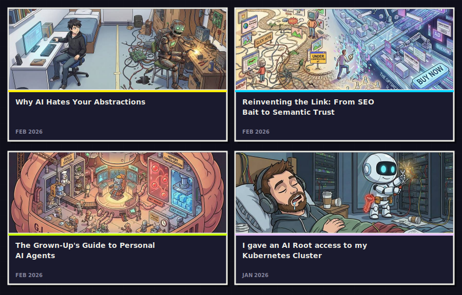

<a href="https://mortenolsen.pro">
<picture>
  <source media="(prefers-color-scheme: dark)" srcset="./images/banner-dark.svg">
  <source media="(prefers-color-scheme: light)" srcset="./images/banner-light.svg">
  
</picture>
</a>

 

&nbsp;

---

I'm **Morten** — a software engineer who's been drifting from .NET to React Native to Kubernetes to whatever shiny thing catches my eye next for the past 15+ years. I also have two kids who are profoundly unimpressed by all of this.

**Currently:** Senior Software Engineer · AI Team @ [ZeroNorth](https://www.zeronorth.com/)

I write about the things I build and the mistakes I make along the way at **[mortenolsen.pro](https://mortenolsen.pro)**.

## ⚡ What I'm Building

<a href="https://mortenolsen.pro/projects/">
<picture>
  <source media="(prefers-color-scheme: dark)" srcset="./images/projects-dark.svg">
  <source media="(prefers-color-scheme: light)" srcset="./images/projects-light.svg">
  
</picture>
</a>

## ✏️ Recent Writing

<a href="https://mortenolsen.pro">
<picture>
  <source media="(prefers-color-scheme: dark)" srcset="./images/posts-dark.svg">
  <source media="(prefers-color-scheme: light)" srcset="./images/posts-light.svg">
  
</picture>
</a>

## 🛠️ Things I Use

<picture>
  <source media="(prefers-color-scheme: dark)" srcset="https://skillicons.dev/icons?i=ts,react,python,rust,astro,nodejs,docker,kubernetes,terraform,aws,linux,neovim&theme=dark&perline=6">
  <source media="(prefers-color-scheme: light)" srcset="https://skillicons.dev/icons?i=ts,react,python,rust,astro,nodejs,docker,kubernetes,terraform,aws,linux,neovim&theme=light&perline=6">
  
</picture>

  

&nbsp;
&nbsp;

---

Auto-generated from <a href="https://github.com/morten-olsen/morten-olsen.github.io">morten-olsen.github.io</a> — because maintaining two sources of truth is a lie I stopped telling myself.

