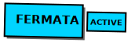
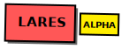
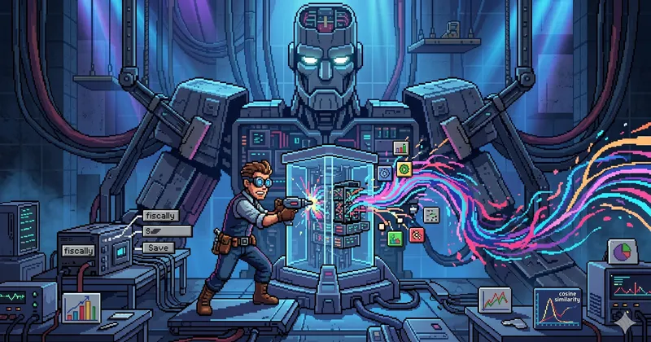
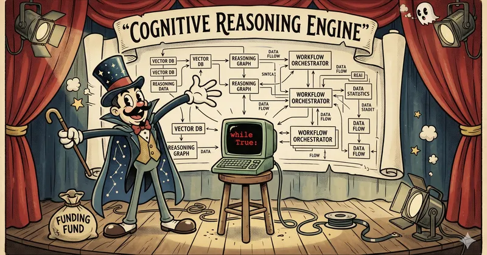
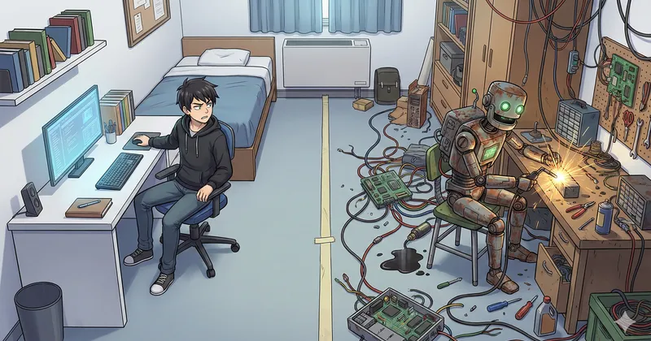
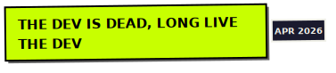

<a href="https://mortenolsen.pro">
<picture><source media="(prefers-color-scheme: dark)" srcset="./images/banner-dark.svg"><source media="(prefers-color-scheme: light)" srcset="./images/banner-light.svg"></picture>
</a>

 

&nbsp;

<picture><source media="(prefers-color-scheme: dark)" srcset="./images/hr-dark.svg"><source media="(prefers-color-scheme: light)" srcset="./images/hr-light.svg"></picture>

I'm **Morten** — a software engineer who's been drifting from .NET to React Native to Kubernetes to whatever shiny thing catches my eye next for the past 15+ years. Currently on the AI team at [ZeroNorth](https://www.zeronorth.com/), helping the maritime industry decarbonize. I also have two kids who are profoundly unimpressed by all of this.

I write about AI agents, infrastructure, developer tools, and the mistakes I make building all of them at **[mortenolsen.pro](https://mortenolsen.pro)**.

<picture><source media="(prefers-color-scheme: dark)" srcset="./images/heading-building-dark.svg"><source media="(prefers-color-scheme: light)" srcset="./images/heading-building-light.svg"></picture>

<a href="https://github.com/morten-olsen/editions"><picture><source media="(prefers-color-scheme: dark)" srcset="./images/name-editions-dark.svg"><source media="(prefers-color-scheme: light)" srcset="./images/name-editions-light.svg"></picture></a>

A self-hosted news reader that assembles RSS feeds into finite, curated magazines using on-device ML for article classification.

<picture><source media="(prefers-color-scheme: dark)" srcset="./images/tags-editions-dark.svg"><source media="(prefers-color-scheme: light)" srcset="./images/tags-editions-light.svg"></picture>

 

<a href="https://github.com/morten-olsen/fermata"><picture><source media="(prefers-color-scheme: dark)" srcset="./images/name-fermata-dark.svg"><source media="(prefers-color-scheme: light)" srcset="./images/name-fermata-light.svg"></picture></a>

A calm, offline-first media player for music, podcasts, and audiobooks — backed by Jellyfin and Audiobookshelf with no ads, accounts, or tracking.

<picture><source media="(prefers-color-scheme: dark)" srcset="./images/tags-fermata-dark.svg"><source media="(prefers-color-scheme: light)" srcset="./images/tags-fermata-light.svg"></picture>

 

<a href="https://github.com/morten-olsen/grimoire"><picture><source media="(prefers-color-scheme: dark)" srcset="./images/name-grimoire-dark.svg"><source media="(prefers-color-scheme: light)" srcset="./images/name-grimoire-light.svg"></picture></a>

A Bitwarden-compatible CLI, SSH agent, and daemon for Vaultwarden — built for engineers who want their secrets served from memory, not files on disk.

<picture><source media="(prefers-color-scheme: dark)" srcset="./images/tags-grimoire-dark.svg"><source media="(prefers-color-scheme: light)" srcset="./images/tags-grimoire-light.svg"></picture>

 

<a href="https://github.com/morten-olsen/homelab-core"><picture><source media="(prefers-color-scheme: dark)" srcset="./images/name-homelab-core-dark.svg"><source media="(prefers-color-scheme: light)" srcset="./images/name-homelab-core-light.svg"></picture></a>

A Kubernetes-based homelab infrastructure stack using Helm charts and ArgoCD for GitOps-driven home server management.

<picture><source media="(prefers-color-scheme: dark)" srcset="./images/tags-homelab-core-dark.svg"><source media="(prefers-color-scheme: light)" srcset="./images/tags-homelab-core-light.svg"></picture>

 

<a href="https://github.com/morten-olsen/lares"><picture><source media="(prefers-color-scheme: dark)" srcset="./images/name-lares-dark.svg"><source media="(prefers-color-scheme: light)" srcset="./images/name-lares-light.svg"></picture></a>

An AI-powered system management daemon that uses Nix for safe, auditable, and rollback-friendly OS automation.

<picture><source media="(prefers-color-scheme: dark)" srcset="./images/tags-lares-dark.svg"><source media="(prefers-color-scheme: light)" srcset="./images/tags-lares-light.svg"></picture>

 

<picture><source media="(prefers-color-scheme: dark)" srcset="./images/heading-writing-dark.svg"><source media="(prefers-color-scheme: light)" srcset="./images/heading-writing-light.svg"></picture>

<a href="https://mortenolsen.pro/posts/does-your-tone-change-your-code/"><picture><source media="(prefers-color-scheme: dark)" srcset="./images/name-does-your-tone-change-your-code-dark.svg"><source media="(prefers-color-scheme: light)" srcset="./images/name-does-your-tone-change-your-code-light.svg"></picture></a>

I fed the same coding prompts through open LLMs in different tones of voice and looked at the model's internal representations. Turns out it cares more about how you ask than what you ask.

 

 

<a href="https://mortenolsen.pro/posts/the-trillion-dollar-while-loop/"><picture><source media="(prefers-color-scheme: dark)" srcset="./images/name-a-mini-agent-dark.svg"><source media="(prefers-color-scheme: light)" srcset="./images/name-a-mini-agent-light.svg"></picture></a>

The entire AI agent industry is built on thirty lines of Python. Let me ruin the word 'agent' for you.

 

 

<a href="https://mortenolsen.pro/posts/the-dev-is-dead-long-live-the-dev/"><picture><source media="(prefers-color-scheme: dark)" srcset="./images/name-the-dev-is-dead-long-live-the-dev-dark.svg"><source media="(prefers-color-scheme: light)" srcset="./images/name-the-dev-is-dead-long-live-the-dev-light.svg"></picture></a>

I build agentic AI platforms for a living and tinker with them for fun. The green grass is real — but getting there required breaking a lot of things first. Here is what went wrong, what we are losing, and why I think you can put the doom articles down.

 

 

<a href="https://mortenolsen.pro/posts/llm-maintainable-code/"><picture><source media="(prefers-color-scheme: dark)" srcset="./images/name-llm-maintainable-code-dark.svg"><source media="(prefers-color-scheme: light)" srcset="./images/name-llm-maintainable-code-light.svg"></picture></a>

I refactored my personal AI to be "more maintainable" for humans, only to find out I might have broken its brain. Is what we call good code actually just noise to an LLM?

 

<a href="https://mortenolsen.pro"><picture><source media="(prefers-color-scheme: dark)" srcset="./images/btn-more-writing-dark.svg"><source media="(prefers-color-scheme: light)" srcset="./images/btn-more-writing-light.svg"></picture></a>

 

<picture><source media="(prefers-color-scheme: dark)" srcset="./images/heading-tools-dark.svg"><source media="(prefers-color-scheme: light)" srcset="./images/heading-tools-light.svg"></picture>

<picture><source media="(prefers-color-scheme: dark)" srcset="./images/skills-dark.svg"><source media="(prefers-color-scheme: light)" srcset="./images/skills-light.svg"></picture>

  

<picture><source media="(prefers-color-scheme: dark)" srcset="./images/badges-dark.svg"><source media="(prefers-color-scheme: light)" srcset="./images/badges-light.svg"></picture>

<picture><source media="(prefers-color-scheme: dark)" srcset="./images/hr-dark.svg"><source media="(prefers-color-scheme: light)" srcset="./images/hr-light.svg"></picture>

Auto-generated from <a href="https://github.com/morten-olsen/morten-olsen.github.io">morten-olsen.github.io</a> — because maintaining two sources of truth is a lie I stopped telling myself.

