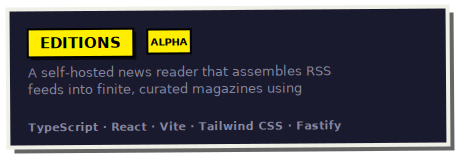
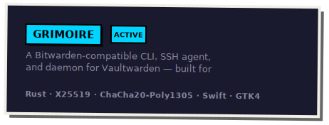
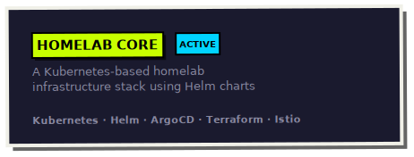
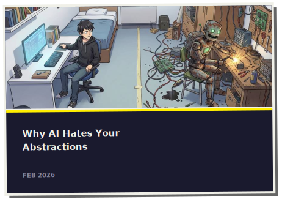
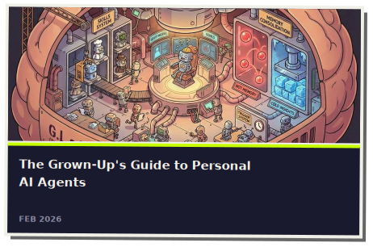
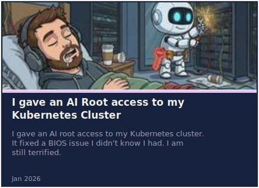

<a href="https://mortenolsen.pro">
<picture><source media="(prefers-color-scheme: dark)" srcset="./images/banner-dark.svg"><source media="(prefers-color-scheme: light)" srcset="./images/banner-light.svg"></picture>
</a>

 

&nbsp;

---

I'm **Morten** — a software engineer who's been drifting from .NET to React Native to Kubernetes to whatever shiny thing catches my eye next for the past 15+ years. I also have two kids who are profoundly unimpressed by all of this.

**Currently:** Senior Software Engineer · AI Team @ [ZeroNorth](https://www.zeronorth.com/)

I write about the things I build and the mistakes I make along the way at **[mortenolsen.pro](https://mortenolsen.pro)**.

## ⚡ What I'm Building

<table>
<tr valign="top">
<td width="50%"><a href="https://github.com/morten-olsen/editions"><picture><source media="(prefers-color-scheme: dark)" srcset="./images/project-editions-dark.svg"><source media="(prefers-color-scheme: light)" srcset="./images/project-editions-light.svg"></picture></a></td>
<td width="50%"><a href="https://github.com/morten-olsen/grimoire"><picture><source media="(prefers-color-scheme: dark)" srcset="./images/project-grimoire-dark.svg"><source media="(prefers-color-scheme: light)" srcset="./images/project-grimoire-light.svg"></picture></a></td>
</tr>
<tr valign="top">
<td width="50%"><a href="https://github.com/morten-olsen/homelab-core"><picture><source media="(prefers-color-scheme: dark)" srcset="./images/project-homelab-core-dark.svg"><source media="(prefers-color-scheme: light)" srcset="./images/project-homelab-core-light.svg"></picture></a></td>
</tr>
</table>

## ✏️ Recent Writing

<table>
<tr>
<td width="50%"><a href="https://mortenolsen.pro/posts/llm-maintainable-code/"><picture><source media="(prefers-color-scheme: dark)" srcset="./images/post-llm-maintainable-code-dark.svg"><source media="(prefers-color-scheme: light)" srcset="./images/post-llm-maintainable-code-light.svg"></picture></a></td>
<td width="50%"><a href="https://mortenolsen.pro/posts/reinventing-the-link-from-seo-bait-to-semantic-trust/"><picture><source media="(prefers-color-scheme: dark)" srcset="./images/post-reinventing-the-link-from-seo-bait-to-semantic-trust-dark.svg"><source media="(prefers-color-scheme: light)" srcset="./images/post-reinventing-the-link-from-seo-bait-to-semantic-trust-light.svg"></picture></a></td>
</tr>
<tr>
<td width="50%"><a href="https://mortenolsen.pro/posts/grown-ups-guide-personal-ai/"><picture><source media="(prefers-color-scheme: dark)" srcset="./images/post-grown-ups-guide-personal-ai-dark.svg"><source media="(prefers-color-scheme: light)" srcset="./images/post-grown-ups-guide-personal-ai-light.svg"></picture></a></td>
<td width="50%"><a href="https://mortenolsen.pro/posts/i-gave-an-ai-root-access-to-my-kubernetes-cluster/"><picture><source media="(prefers-color-scheme: dark)" srcset="./images/post-ai-devops-dark.svg"><source media="(prefers-color-scheme: light)" srcset="./images/post-ai-devops-light.svg"></picture></a></td>
</tr>
</table>

## 🛠️ Things I Use

<picture>
  <source media="(prefers-color-scheme: dark)" srcset="https://skillicons.dev/icons?i=ts,react,python,rust,astro,nodejs,docker,kubernetes,terraform,aws,linux,neovim&theme=dark&perline=6">
  <source media="(prefers-color-scheme: light)" srcset="https://skillicons.dev/icons?i=ts,react,python,rust,astro,nodejs,docker,kubernetes,terraform,aws,linux,neovim&theme=light&perline=6">
  
</picture>

  

&nbsp;
&nbsp;

---

Auto-generated from <a href="https://github.com/morten-olsen/morten-olsen.github.io">morten-olsen.github.io</a> — because maintaining two sources of truth is a lie I stopped telling myself.

