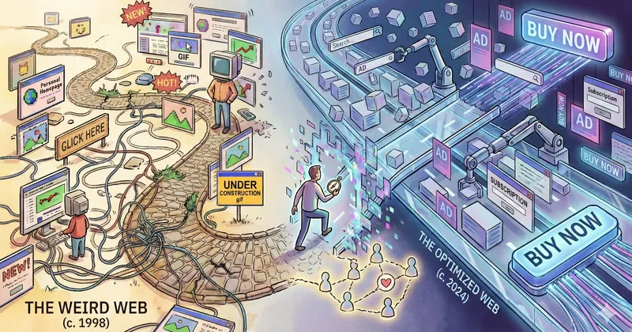
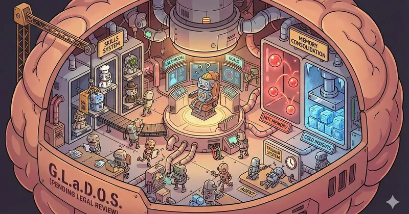

<a href="https://mortenolsen.pro">
<picture><source media="(prefers-color-scheme: dark)" srcset="./images/banner-dark.svg"><source media="(prefers-color-scheme: light)" srcset="./images/banner-light.svg"></picture>
</a>

 

&nbsp;

<picture><source media="(prefers-color-scheme: dark)" srcset="./images/hr-dark.svg"><source media="(prefers-color-scheme: light)" srcset="./images/hr-light.svg"></picture>

I'm **Morten** — a software engineer who's been drifting from .NET to React Native to Kubernetes to whatever shiny thing catches my eye next for the past 15+ years. Currently on the AI team at [ZeroNorth](https://www.zeronorth.com/), helping the maritime industry decarbonize. I also have two kids who are profoundly unimpressed by all of this.

I write about AI agents, infrastructure, developer tools, and the mistakes I make building all of them at **[mortenolsen.pro](https://mortenolsen.pro)**.

<picture><source media="(prefers-color-scheme: dark)" srcset="./images/heading-building-dark.svg"><source media="(prefers-color-scheme: light)" srcset="./images/heading-building-light.svg"></picture>

<a href="https://github.com/morten-olsen/editions"><picture><source media="(prefers-color-scheme: dark)" srcset="./images/name-editions-dark.svg"><source media="(prefers-color-scheme: light)" srcset="./images/name-editions-light.svg"></picture></a> 

A self-hosted news reader that assembles RSS feeds into finite, curated magazines using on-device ML for article classification.

<picture><source media="(prefers-color-scheme: dark)" srcset="./images/tags-editions-dark.svg"><source media="(prefers-color-scheme: light)" srcset="./images/tags-editions-light.svg"></picture>

 

<a href="https://github.com/morten-olsen/grimoire"><picture><source media="(prefers-color-scheme: dark)" srcset="./images/name-grimoire-dark.svg"><source media="(prefers-color-scheme: light)" srcset="./images/name-grimoire-light.svg"></picture></a> 

A Bitwarden-compatible CLI, SSH agent, and daemon for Vaultwarden — built for engineers who want their secrets served from memory, not files on disk.

<picture><source media="(prefers-color-scheme: dark)" srcset="./images/tags-grimoire-dark.svg"><source media="(prefers-color-scheme: light)" srcset="./images/tags-grimoire-light.svg"></picture>

 

<a href="https://github.com/morten-olsen/homelab-core"><picture><source media="(prefers-color-scheme: dark)" srcset="./images/name-homelab-core-dark.svg"><source media="(prefers-color-scheme: light)" srcset="./images/name-homelab-core-light.svg"></picture></a> 

A Kubernetes-based homelab infrastructure stack using Helm charts and ArgoCD for GitOps-driven home server management.

<picture><source media="(prefers-color-scheme: dark)" srcset="./images/tags-homelab-core-dark.svg"><source media="(prefers-color-scheme: light)" srcset="./images/tags-homelab-core-light.svg"></picture>

<picture><source media="(prefers-color-scheme: dark)" srcset="./images/heading-writing-dark.svg"><source media="(prefers-color-scheme: light)" srcset="./images/heading-writing-light.svg"></picture>

<a href="https://mortenolsen.pro/posts/llm-maintainable-code/"><picture><source media="(prefers-color-scheme: dark)" srcset="./images/name-llm-maintainable-code-dark.svg"><source media="(prefers-color-scheme: light)" srcset="./images/name-llm-maintainable-code-light.svg"></picture></a>

Feb 2026

I refactored my personal AI to be "more maintainable" for humans, only to find out I might have broken its brain. Is what we call good code actually just noise to an LLM?

 

 

<a href="https://mortenolsen.pro/posts/reinventing-the-link-from-seo-bait-to-semantic-trust/"><picture><source media="(prefers-color-scheme: dark)" srcset="./images/name-reinventing-the-link-from-seo-bait-to-semantic-trust-dark.svg"><source media="(prefers-color-scheme: light)" srcset="./images/name-reinventing-the-link-from-seo-bait-to-semantic-trust-light.svg"></picture></a>

Feb 2026

I accidentally reinvented PageRank, realized why it’s broken today, and decided to try building a personal web of trust instead.

 

 

<a href="https://mortenolsen.pro/posts/grown-ups-guide-personal-ai/"><picture><source media="(prefers-color-scheme: dark)" srcset="./images/name-grown-ups-guide-personal-ai-dark.svg"><source media="(prefers-color-scheme: light)" srcset="./images/name-grown-ups-guide-personal-ai-light.svg"></picture></a>

Feb 2026

Handing the keys to your digital life to an AI is like juggling chainsaws. I built a persistent assistant that knows me, but without the ability to blow my savings at a robot casino.

 

 

<a href="https://mortenolsen.pro/posts/i-gave-an-ai-root-access-to-my-kubernetes-cluster/"><picture><source media="(prefers-color-scheme: dark)" srcset="./images/name-ai-devops-dark.svg"><source media="(prefers-color-scheme: light)" srcset="./images/name-ai-devops-light.svg"></picture></a>

Jan 2026

I gave an AI root access to my Kubernetes cluster. It fixed a BIOS issue I didn’t know I had. I am still terrified.

 

<a href="https://mortenolsen.pro"><picture><source media="(prefers-color-scheme: dark)" srcset="./images/btn-more-writing-dark.svg"><source media="(prefers-color-scheme: light)" srcset="./images/btn-more-writing-light.svg"></picture></a>

 

<picture><source media="(prefers-color-scheme: dark)" srcset="./images/heading-tools-dark.svg"><source media="(prefers-color-scheme: light)" srcset="./images/heading-tools-light.svg"></picture>

<picture><source media="(prefers-color-scheme: dark)" srcset="./images/skills-dark.svg"><source media="(prefers-color-scheme: light)" srcset="./images/skills-light.svg"></picture>

  

<picture><source media="(prefers-color-scheme: dark)" srcset="./images/badges-dark.svg"><source media="(prefers-color-scheme: light)" srcset="./images/badges-light.svg"></picture>

<picture><source media="(prefers-color-scheme: dark)" srcset="./images/hr-dark.svg"><source media="(prefers-color-scheme: light)" srcset="./images/hr-light.svg"></picture>

Auto-generated from <a href="https://github.com/morten-olsen/morten-olsen.github.io">morten-olsen.github.io</a> — because maintaining two sources of truth is a lie I stopped telling myself.

